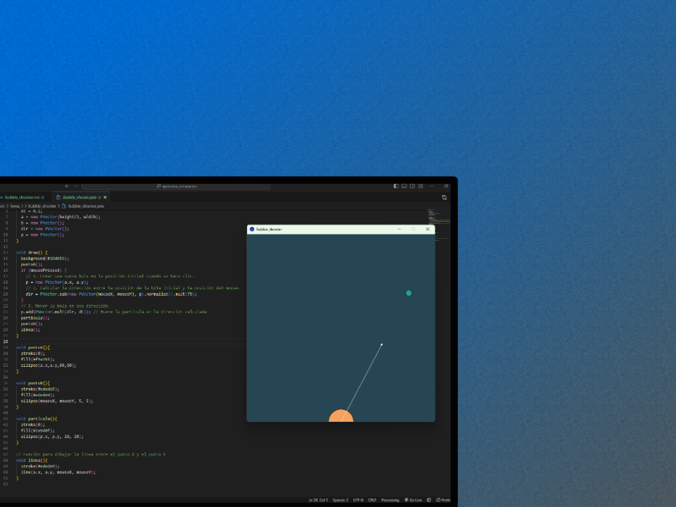

# Ejercicio Bubble Shooter 🔫
## Enunciado
Hacer un **bubble-shooter** sencillo (lanzador de bolas con velocidad constante).

## Velocidad constante en todo el intervalo
Formulas en las que me he basado para resolverlo:

$$
\begin{align*}
v_{media} =\frac{ \vartriangle x} {\vartriangle t} \\
x += v_{media} * \vartriangle t
\end{align*}
$$

Primero se ha creado un _punto A_ fijo, y un _punto B_ con la posicion del ratón. Después se ha creado un vector entre ambos _dir_ que llevará la dirección de la particula _P_. 
```java
void puntoA(){
  stroke(0);
  fill(#f4a261);
  ellipse(a.x,a.y,80,80);
}

void puntoB(){
  stroke(#edede9);
  fill(#edede9);
  ellipse(mouseX, mouseY, 5, 5);
}
```

Luego con un evento de ratón he implementado el lanzamiento de la particula en base al vector dirección (_dir_).
```java
  if (mousePressed) {
    // 1. Crear una nueva bola en la posición inicial cuando se hace clic.
    p = new PVector(a.x, a.y);
    // 2. Calcular la dirección entre la posición de la bola inicial y la posición del mouse.
    dir = PVector.sub(new PVector(mouseX, mouseY), p).normalize().mult(75);
  }
    // 3. Mover la bola en esa dirección.
  p.add(PVector.mult(dir, dt)); // Mueve la partícula en la dirección calculada
```
Siendo **p** la **Particula** que se desplaza y **dir** siendo la **velocidad media** y direccion en el tramo.


