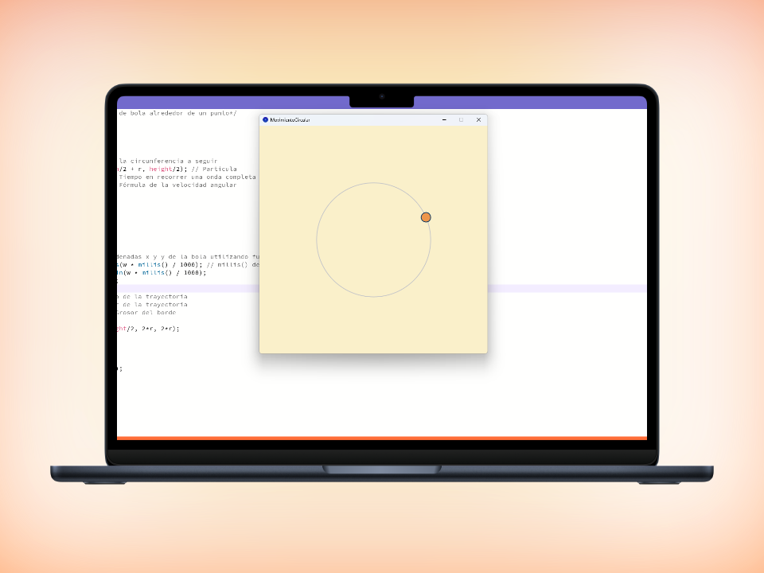

# Ejercicio Movimiento circular ⚾
## Enunciado
Simular el movimiento de una bola alrededor de un punto
situado a una distancia r de la bola. Dará una vuelta por segundo.

## Movimiento circular uniforme
En que me he basado para resolverlo:

Periodo **T** : Tiempo en recorrer una onda completa en función periodica

Velocidad angular (**w**):

$$
w = \frac{2 \pi} {T}
$$

Se ha implementado de la siguiente manera en el codigo:
```java
t = 1; // Periodo -> Tiempo en recorrer una onda completa
w = (2 * PI) / t; // Fórmula de la velocidad angular
```

Para actualizar la posición:

$$
\begin{align*}
x = r * cos(w*t) \\
y = r * sin(w*t)
\end{align*}
$$


Se ha implementado de esta manera:
```java
// Calcular las coordenadas x y y de la bola utilizando funciones trigonométricas
x = width/2 + r * cos(w * millis() / 1000); 
// millis() devuelve el tiempo transcurrido en milisegundos
y = height/2 + r * sin(w * millis() / 1000);
  
```

