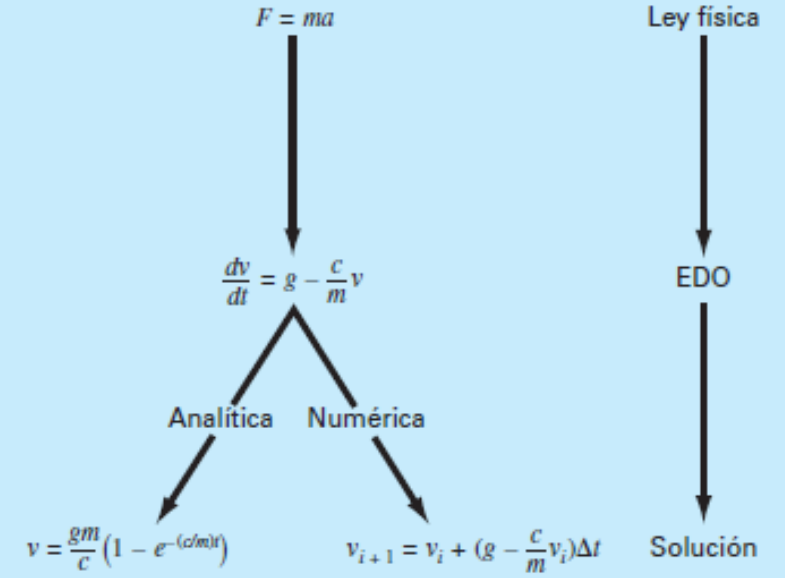
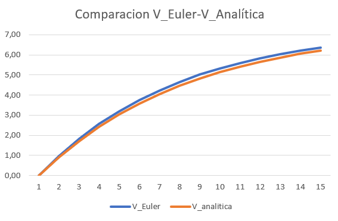

# Ejercicio Paracaidista con Euler Explícito

La velocidad de caída de un paracaidista en función del tiempo viene dada por la siguiente ecuación:

$$
\frac{dv}{dt} = g−\frac{c}{m}v 
$$ 

Siendo _g_ la constante gravitacional, _m_ la masa y _c_ el
coeficiente de arrastre.

Analizar ecuación (módulo) y dibujar los vectores principales del escenario.
Incluir las condiciones iniciales (p,ej. una persona de 80 Kg de peso que saltó de una cabina a 36 Km de altura, dió un pequeño paso adelante, vel (1,0) m/s).

Iterar con el método de Euler para ir obteniendo la velocidad en los 10
primeros segundos (dt = 1).

| Parámetros       | Ecuación diferencial (aceleración) |
|------------------|------------------------------------|
| dt               | 0.1                                |
| g                | 9.8                                |
| m                | 60                                 |
| c (coef. arrastre)| 80                                |

Para sacar la **aceleración** del paracaidista hay que tener en cuenta que

 $$\vec{a}_{paracaidista}=\frac{d\vec{v}}{dt}=\vec{g}-\frac{c}{m}\times\vec{v}$$

Para sacar la **velocidad de euler** se obtiene con 

$$\vec{v}_{i+1} = \vec{v}_i+ \vec{a}_{i}\times dt$$

Para sacar la **velocidad analítica** se obtiene con

$$
v = \frac{gm}{c}(1-e^{-(c/m)t})
$$

Y para obtener el **Error de Euler**  se hace el valor absoluto de la diferencia entre el resultado de euler y el analitico.

$$
\left| v_{euler} - v_{analitica} \right|
$$

## Resultados
Los resultados en una tabla quedarían así:

| t   | A = dv/dt    | V_Euler | V_analitica |   Error(Euler_exp) |
|-----|------|-------|---------|-------------|
| 0,00| 9,80 | 0,00  | 0,00    | 0,06        | 
| 0,10| 8,49 | 0,98  | 0,92    | 0,11        | 
| 0,20| 7,36 | 1,83  | 1,72    | 0,14        | 
| 0,30| 6,38 | 2,57  | 2,42    | 0,17        | 
| 0,40| 5,53 | 3,20  | 3,04    | 0,18        | 
| 0,50| 4,79 | 3,76  | 3,58    | 0,19        | 
| 0,60| 4,15 | 4,24  | 4,05    | 0,19        | 
| 0,70| 3,60 | 4,65  | 4,46    | 0,19        | 
| 0,80| 3,12 | 5,01  | 4,82    | 0,19        | 
| 0,90| 2,70 | 5,32  | 5,14    | 0,18        | 
| 1,00| 2,34 | 5,59  | 5,41    | 0,17        | 
| 1,10| 2,03 | 5,83  | 5,65    | 0,16        | 
| 1,20| 1,76 | 6,03  | 5,87    | 0,15        | 
| 1,30| 1,53 | 6,21  | 6,05    | 0,15        | 
| 1,40| 1,32 | 6,36  | 6,21    | 0,00        |

