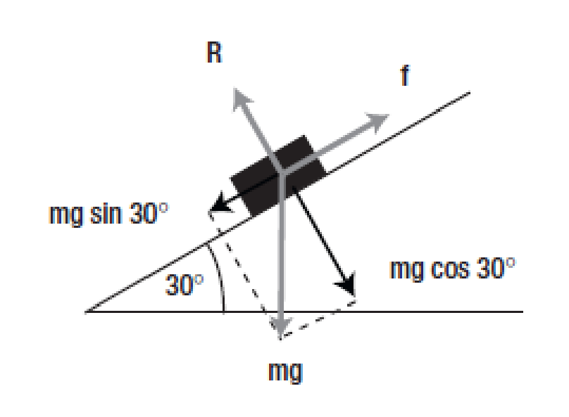
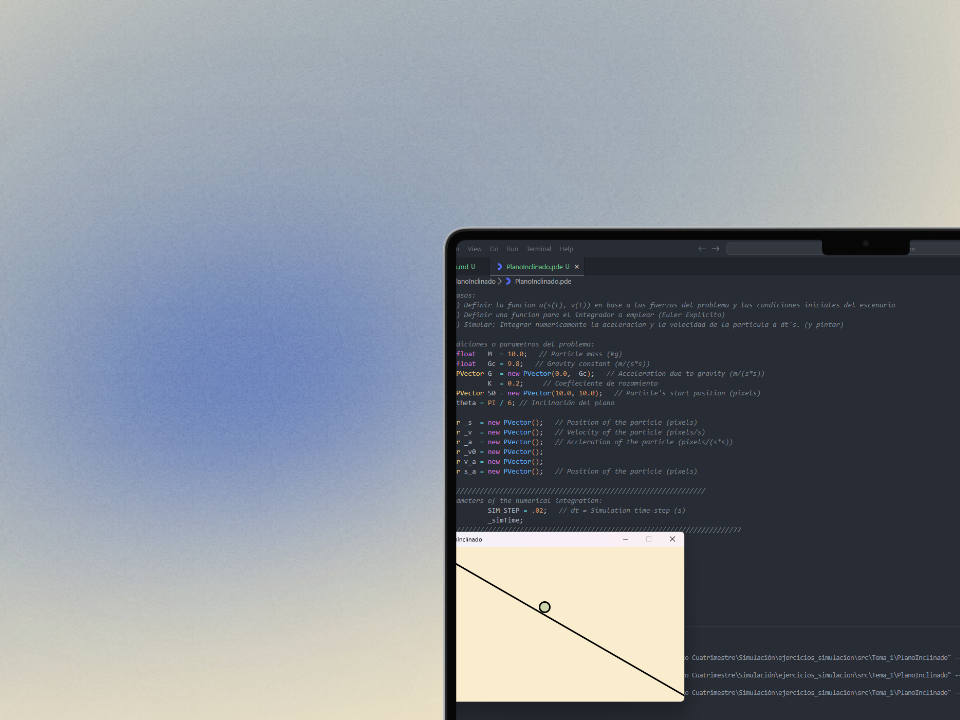

# Descomposición de fuerzas, Plano inclinado 📉

## Enunciado
El peso se descompone en normal y tangencial al plano de movimiento (en este caso inclinado).

- El Rozamiento (fricción): $f=-kv$ . Se opone al movimiento (velocidad negada).
- La normal se anula con R.
- $F=m·g·\sin(30º)-f$

## Resolución
Para resolverlo nos tenemos que basar en la segunda ley de newton para calcular las fuerzas 

$$
\sum F= m·a
$$

Donde tendremos que obtener la fuera de rozamiento y el peso, pero al estar en un plano inclinado tenemos que tener en cuenta el ángulo de este, al que hemos llamado _Unitario_. A continuación despejamos de la fórmula para calcular la aceleración.

```java
PVector calculateAcceleration(PVector s, PVector v)
{

    PVector Unitario = new PVector(cos(theta), sin(theta));
    PVector Froz  = PVector.mult(Unitario, PVector.mult(v,-K).mag());
    PVector Fpeso = PVector.mult(Unitario, PVector.mult(G,M).mag());

    PVector SumF  = PVector.add(Froz, Fpeso);
    
    PVector a = SumF.div(M);

    return a;
}
```

Además para calcular la posición y velocidad se ha empleado Euler Simpléctico.
