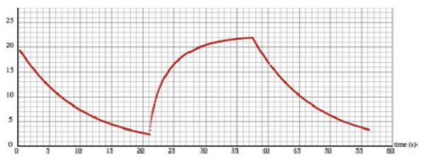

# Simulador de coche🚗

## Enunciado

Simularemos el acelerador de un coche.
- Clase coche ($masa, vel, E_c$).
- _AplicarPotencia()_, actualizar $E_c=P \Delta t$ al pulsar una tecla.
- Pérdida de energía (rozamiento $F=-kv$) entonces $P=Fv=-kv^2$
- _updateVelo()_, actualiza la velocidad $v=\sqrt{2 E_c/m}$


Obtener la gráfica de velocidad y simular el movimiento de un
coche con acelerador (trayectoria libre).

## Resolución

Para resolverlo nos tenemos que basar en la segunda ley de newton para calcular las fuerzas 

$$
\sum F= m·a
$$

Lo que he hecho ha sido crear una fuerza de rozamiento $Froz=-vk$ que se aplica cuando el coche tiene velocidad.
```java
PVector calculateAcceleration(PVector s, PVector v)
{
    PVector Froz = new PVector(0.0, 0.0);
    if(v.mag() > 0.01) { // Umbral de velocidad
        Froz = PVector.mult(v,-K);
    }
    PVector SumF  = PVector.add(Froz, Fimpulsador);
  
    PVector a = SumF.div(M);

    return a;
}
```

Lo que he hecho para el desplazamiento es cuando se pulse la tecla _a_ aplica una fuerza llamada _Fimpulsador_ que aplica en la dirección (1,0) una constante _impulsador_:
```java
void AplicarPotencia() {
    PVector normal_aceleracor = new PVector(1.0,0.0);
    normal_aceleracor.normalize();
    Fimpulsador = PVector.mult(normal_aceleracor,impulsador);
}
```

Y cuando se deja de pulsar esta tecla, al igual que un coche deja de ejercer fuerza, por lo que se pone la fuerza del impulsador a 0:
```java
void keyReleased()
{
    if(key == 'a' || key == 'A')
    {
        Fimpulsador.set(0.0, 0.0);
    }
}
```