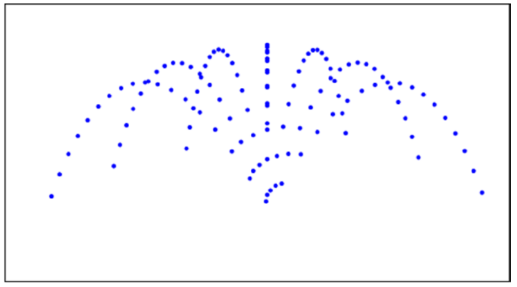

# Emisores de partículas. Fuente⛲	

## Enunciado

Las partículas van apareciendo desde un punto: efectos de humo, explosiones, etc.
- Velocidad inicial: en función del escenario (ej. explosión, humo...).
- Fuerzas principales: Gravedad, viento ...
- Implementar el emisor (fuente) de la figura o similar:


## Resolución

Se han creado unas partículas con un tiempo de vida y una masa _m_ muy pequeña ya que se suponen que son gotas de agua emitidas por una fuente, se han generado con una aceleración y velocidad aleatorias. Además estas le he aplicado únicamente la fuerza de gravedad. Me he basado en las siguientes fórmulas:

$$
F_g=m·a
$$

Se han puesto las velocidades y aceleración negativa por la referencia de ejes, por eso se ha puesto la gravedad positiva.
```java
  void update() {
    PVector gravity_force = new PVector(0, gravity * mass); // Fuerza de gravedad
    acceleration.add(gravity_force); // Agregar gravedad a la aceleración
    velocity.add(acceleration);
    position.add(velocity);
    lifespan -= 2;
  }
  ```