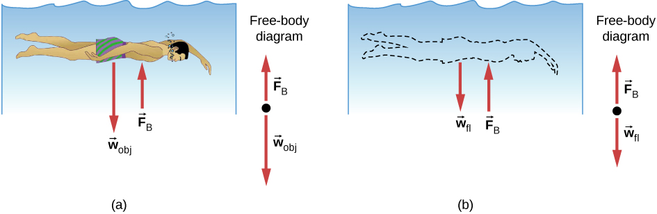

# La partícula flotante 🍧

## Enunciado

- Volúmenes básicos
- Estabilidad: Centro de gravedad/masas y de flotación.
- Fuerza de flotación: $F_B = \rho · g·V_s$, $\rho = densidad , V_s = $ Vol. sumergido.
- $V_{s-totalmente-sumergido}=4 \pi ·radius ·radius ·radius/3$ 
- Parcialmente sumergido
    - $h=location.y + radius - height/2$
    - $a= \sqrt{2·h·radius-h·h}$
    - $V_s=(3·a·a+h·h)· \pi ·h /6$

## Resolución

Se ha creado una clase partícula donde dentro de esta se aplican la fuerza a la partícula, donde tendremos en cuenta su radio(*_r*) su masa(*_m*) y su flotabilidad (_buoyancy_). Tambien se ha creado una función para aplicar la gravedad $a=\frac{F_g}{m}$.
 
Y luego tenemos 3 casos concretos, cuando la particula esta dentro del agua, cuando esta en la línea y cuando esta fuera:
- Cuando esté dentro del agua o en la línea se le aplicará la flotabilidad y una fuerza de rozamiento $F_{roz}=-vK$ siendo _v_ la velocidad y _K_ la fricción del agua. Estas se nos proporcionan en el enunciado.
- Cuando está fuera del agua no se le aplica ninguna fuerza, salvo la de gravedad que se aplica en todo momento.

```java
  void calculateForces() {
    float buoyancy;
    PVector froz = new PVector(0, 0);
    PVector vFb = new PVector(0, 0);

    if (_position.y - _r >= water_height) { //dentro
      buoyancy = 4.0 * PI * pow(_r, 3) / 3.0;
      froz.y = - water_friction * _velocity.y;
    } else if (_position.y + _r / 2 > water_height && _position.y - _r / 2 < water_height) { //en la línea
      float h = _position.y + _r - height/1.5;
      float a = sqrt(2 * h * _r - pow(h, 2));
      buoyancy = (3 * pow(a,2) + pow(h, 2)) * PI * h / 6.0;
      froz.y = -water_friction * _velocity.y; 
    } else { //fuera
      buoyancy = 0;
      froz.y = 0;
    }

    vFb.y = - _d * G.y * buoyancy;
    accelerate(vFb);   
    accelerate(froz);
  }

```
